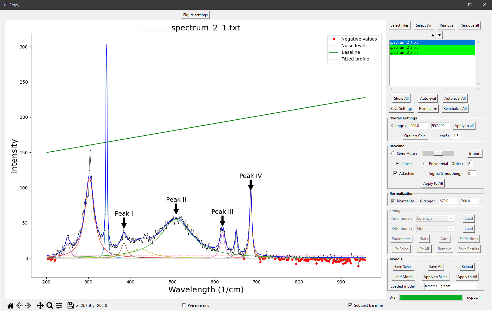

# Fitspy

**Fitspy** is a generic tool dedicated to **FIT** **SP**ectra in
**PY**thon.

Its GUI aims to be as simple and intuitive as possible.

Processed spectra may be independent of each other or may result from
ordered or unordered 2D-maps acquisitions.

The fitting algorithm has multiprocessing capabilities. It relies on
the `lmfit` library which allows to set bounds and constraints on each peaks
models parameter.

The peak models considered in **Fitspy** are :

* `Gaussian`
* `Lorentzian`
* `Asymetric Gaussian`
* `Asymetric Lorentzian`
* `Pseudovoigt`

A `constant`, `linear`, `parabolic`, `Gaussian` or
`exponential` background can be added in the fitting.

All actions allowed by the GUI can be easily executed in script mode
(see examples [here](examples)).

The users instructions can be saved in a 'Fitspy' `model` and replayed
identically to the same spectra (`reload` mode) or applied to other new
spectra

### Authors informations

In case you use the results of this code in your article, please cite:

- (To come)

