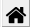
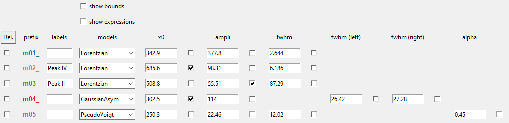

# Fitspy Documentation

## Introduction

The main class of Fitspy is [`Spectra`](../fitspy/spectra.py) (inherited
from `list`) that contains a list of  [`Spectrum`](../fitspy/spectra.py)
objects.

For each of these [`Spectrum`](../fitspy/spectra.py) objects, the correspondning (x, y) profile is associated.

Given the users instructions, a `baseline`
can be defined, as well as a list of `peaks` models (Gaussian, Lorentzian
, ...) used to fit the spectra profiles.

In term of usage, to avoid confusing situations,
it is recommanded to address spectra processing from the top to the bottom frames as depicted hereafter.

## Preliminary remarks

**Axis limits**  
To ease the comparison between spectra, the (x, y) axis limits are
defined from the first spectrum displayed on the figure. 
Then, they are applied to all the following ones. 
To readapt the axis limits to the current spectrum click
on  of the navigation toolbar
(auto-rescaling).

**Mouse management**  
click buttons with the mouse is used with the
navigation toolbar for zooming and translating as well as for defining
baseline points or peaks points. 
The activation/deactivation of the mouse associated to these 2 last modes (baseline and peaks selection) requires the corresponding
frames to be "clicked" beforehand.

## Files selection

The files selection is realized thanks to the following widget:

Two types of data can be interpreted.

* The first one consists in input data files that contains 2 columns
  related to respectively the support (x) and the spectrum intensity (y).
  The separators between the columns can be the tabulation `\t`, the coma
  `,`, the semicolon `;` or the space ` `. Note that the first row is skipped
  and the (x, y) rows can be unordered.

* The second one is related to **2D-map** input data. the first line of the
  file is related to the support (x) of the spectra and starts with 2
  tabulations `\t`. the next rows are related to the spectra intensity at
  the 'pixel' coordinates (X), (Y) defined in the 2 firsts columns.
  Note that the number of intensity values has to be consistent with the
  support (x) defined in the first row. X-Y spectra can be defined in a partial and unordered 2D grid.

  Once loaded, a 2D-map is expanded. The associated spectra appear in the files selection widget 
  according the 2D-map file basename and the (X) and (Y) spectrum coordinates in the grid. 
  A 2D-map figure is also opened to easily interact with the cursor selection of the file selection widget.

  interactive 2D-maps figures resulting from a <a href="../examples/data/2D_maps/ordered_map.txt">full-defined ordered acquisition grid</a> (left) 
  and a <a href="../examples/data/2D_maps/unordered_map.txt">partial unordered one</a> (right)    
  
  

## Global actions

`Show All` allows to have a global vision of all the spectra.  When clicking
with the mouse on the canvas, the nearest spectra are highlighted (in the limit
of 10 spectra max).

`Auto eval` and `Auto eval All` realize automatic evaluation of the baseline and
peaks positions and operate fitting to the selected spectra or
to all the spectra (resp.).

`Save settings` allows to save the users settings in a *.fitspy.json* file
loacated in the `%HOMEUSER%` (see this file to see what kind of settings are
saved).

`Reinitialize` and `Reinitialize All` refresh the spectra to their original values.

## Overall settings

`X-range` allows to display and modifiy the (x) support range associated
to the current spectrum.

`Apply to All`  applies the (x) support range `X-range` to all the spectra.

`Attractors` are related to the local maxima intensities. When activated,
attractors are used for baseline and peaks points locations. 
The attractors points are calculated with scipy.signal.find_peaks()
from the parameters defined in `Settings`.
See [scipy.signal.find_peaks](https://docs.scipy.org/doc/scipy/reference/generated/scipy.signal.find_peaks.html)
for more details.

## Baseline

The present frame is activated and deactivated when clicking on it.

`Import` allows the user to import its own baseline profile. The
imported file should contain 2 columns associated to the (x,y) baseline
points coordinates. As for spectrum profiles, the separators between the columns can be the tabulation
`\t`, the coma `,`, the semicolon `;` or the space ` `. Note that the first
row is skipped and the (x, y) rows can be unordered.

`Auto` can be used for an automatic determination of the baseline
points considering the `Min distance` (minimum distance) between two
consecutive points (in pixel).

`Attached` makes the baseline attached to the raw spectrum profile or to
a smoothed one issued from a gaussian filtering applied to the raw spectrum profile and using `Sigma` as standard
deviation (in pixel).

Baseline profiles are defined either from `Linear` piecewise or from
`Polynomial` approximation considering the given `Order`.
Note that a '*n*'-order polynomial approximation requires at least '*n+1*'
points to be satsified.

## Normalization

An **optionnal** spectra normalization is proposed and relies on the two following strategies:

* `Maximum`: each spectrum is normalized at 100 according to its maximum intensity.

* `Attractor`: each spectrum is normalized at 100 according to the intensity 
  of the nearest attractor located at the x-position given by the user.

To be effective, the user should press on `Apply to all`.

## Peaks

The present frame is activated and deactivated when clicking on it.

`Auto` can be used for an automatic determination of the peaks, considering 
the selected `Peak model`. 

For a user manual peaks positioning, the `Peak model` (to choose 
between `Gaussian`, `Lorentzian`, `Asymetric Gaussian`, `Asymetric Lorentzian` and `Pseudovoigt`)
 is applied when left-clicking in the spectrum figure. A right click allows to remove the nearest peak.

The available peak models are:

* `Gaussian` : $ampli * exp({-(x-x0)^2/(2*\sigma^2)})$
* `Lorentzian` : $ampli * fwhm^2 / [4 * ((x - x0)^2 + fwhm^2 / 4)]$
* `Asymetric Gaussian` : $(x < x0) * Gaussian (fwhm_l) +  (x ≥ x0) * Gaussian (fwhm_r)$
* `Asymetric Lorentzian` : $(x < x0) * Lorentzian (fwhm_l) +  (x ≥ x0) * Lorentzian (fwhm_r)$
* `Pseudovoigt` : $alpha * Gaussian + (1 - alpha) * Lorentzian $

`Fit` and `Fit All` realize the fitting in the conditions defined in `Fit Settings`.

`maxmimum iterations` can be used to limit the number of iterations and save CPU time processing consequently.  
(An iteration corresponds to a gradient descent attached to all the fit parameters).

Spectrum fit success or failure (related to reach a fit convergence criteria before reaching the `maxmimum iterations`) is displayed 
in green or orange (resp.) in the file selector widget.

It is worth noting that doing several successive fits on a spectrum may change slightly the fitted parameters.

`Parameters` allows to visualize parameters values and statistics related to the fitting processing. 
The parameters widget can be used to interact with  each of the spectra (deleting or labelling peak models, redefining models). 
All parameters are considered as free by default but may be fixed during the fitting thanks to the right-handed selection boxes. 

Bounds and fit constraints can be adressed when activating the dedicated selectors loacated at the top of the parameters widget.

**Bounding** consists in giving left and right parameters bounds. 

**Constraints** relies on expressions that can be parameters dependant, using the prefix defined in the 2nd column.  
Example below shows how to constrain the second fitted peak to be half the first one in term of amplitude.

`Save (.csv)` consists in saving the fitted parameters and related statistics in a 
folder predefined by the user, repectively in a .csv and a .txt file using the spectrum file basename.

## Models

The **Models** frame is used to save and replay a full spectra processing as 
is. 

`Save Selec.` or `Save All` allow to save the spectra processing 
associated to the selected spectra in the files selection widget or to all the spectra.

`Reload` replays exactly the spectra processing related to the imported *.json*.  
This implies that all the files defined in the *.json*  are reachables when reloading.

`Load Model` consists in reloading the spectrum model (baseline and peaks definition, ... **not the spectrum file itself**) 
related to the first one saved in the *.json*.

`Apply to Sel.` or `Apply to All` allow to apply the loaded model to the spectra selected in the files selection widget, or to all the 
spectra. 

## Figure

The Figure section displays the loaded spectra and allows to make baseline and 
peaks models manipulations with the mouse.

The standard navigation toolbar from *Matplotlib* allows to pan, zoom and save the current figure. 
The function associated to the   icon has been reconfigured to 
allow spectra rescaling.

`Figure settings` allows to personalize plots displaying and figure title and axis labels.

All the figures can be saved in .png format. (beware of 2D-maps which can engender a large amount of figures)

To ease copy/paste,  `CTRL+C` allows to put the current figure in the clipboard (only on Windows).

