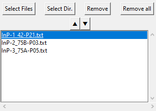
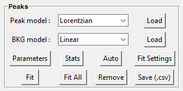

# Fitspy Documentation

## Introduction

The main class of Fitspy is [`Spectra`](../fitspy/spectra.py) (inherited
from `list`) that contains a list of  [`Spectrum`](../fitspy/spectra.py)
objects.

For each of these [`Spectrum`](../fitspy/spectra.py) objects, the corresponding (x, y) profile is associated.

Additionally, 2D maps of spectra (named `SpectraMap`) can be provided as input according to a dedicated format. They consist in a set of `Spectrum` with associated grid coordinates (see below).

The spectra processing are based on  `baselines` definition (optional) and `peaks` models definition (Gaussian, Lorentzian, ...) used to fit the spectra profiles.

**Important: In terms of usage, to avoid confusion, it is recommended to address spectra processing from the top to the bottom frames as depicted hereafter**.

## Preliminary remarks

**Axis limits** 
To facilitate the comparison between spectra visually, the (x, y) axis limits in the figure are set based on the first displayed spectrum. 
Subsequently, these limits are applied to all the following spectra. 
To readjust the axis limits to the current spectrum click on  of the navigation toolbar (auto-rescaling).

**Mouse management** 
Mouse click buttons are used both with the navigation toolbar (for zooming and translating) and for defining baseline points or peaks points. 
The activation/deactivation of the mouse associated with these last 2 modes (baseline and peaks selection) requires the corresponding frames to be "clicked" beforehand.

## Files selection

The files selection is realized thanks to the following widget:

Two types of data can be interpreted.

* The first type consists of input data files containing 2 columns representing the support (x) and spectrum intensity (y) respectively.
  The separators between the columns can be tabulation `\t`, comma `,`, semicolon `;` or space ` `. Note that the first row is skipped and the (x, y) rows can be unordered.

* The second type is associated with **2D-map** input data. the first line of the file is related to the support (x) of the spectra and starts with 2 tabulations `\t`. The subsequent rows are related to the spectra intensity at the 'pixel' coordinates (X), (Y) defined in the first 2 columns.
  Note that the number of intensity values must be consistent with the support (x) defined in the first row. X-Y spectra can be defined in a partial and unordered 2D grid.

  Once loaded, a 2D-map is expanded. The associated spectra appear in the files selection widget to according to the 2D-map file basename and the (X) and (Y) spectrum coordinates in the grid.
  A 2D-map figure is also opened to facilitate interaction with the cursor selection of the files selector widget.

  interactive 2D-maps figures resulting from a <a href="../examples/data/2D_maps/ordered_map.txt">fully defined ordered acquisition grid</a> (left) and a <a href="../examples/data/2D_maps/unordered_map.txt">partially unordered one</a> (right)    
  
  

## Global actions

`Show All` enables a global display of all the spectra. When clicking on the canvas with the mouse, the nearest spectra are highlighted (up to a maximum of 10 spectra).

`Auto eval` and `Auto eval All`  perform automatic evaluation of the baseline and peak positions and conduct fitting on the selected spectra or all the spectra (respectively).

`Save settings` enables the saving of user settings in a .fitspy.json file located in the `%HOMEUSER%` directory (refer to this file to understand the types of settings saved).

`Reinitialize` and `Reinitialize All` reinitialize the spectrum and all the spectra (resp.) to their original values.

## Overall settings

`X-range` allows the modification of the (x) support range associated with the current spectrum.

`Apply to All`  applies the (x) support range defined in `X-range` to all the spectra.

`Attractors` are associated with local maxima intensities. When activated, attractors are used for locating baseline and peaks points. 
The attractors points are calculated using scipy.signal.find_peaks() based on the parameters defined in `Settings`. Refer to [scipy.signal.find_peaks](https://docs.scipy.org/doc/scipy/reference/generated/scipy.signal.find_peaks.html) for more details.

## Baseline

**The current frame is activated and deactivated when clicking on it.**

`Import` enables the user to import their own baseline profiles. The imported file should contain 2 columns associated with the (x,y) coordinates of the baseline points. Similar to spectrum profiles, the separators between the columns can be tabulation `\t`, comma `,`, semicolon `;` or space ` `. Note that the first row is skipped, and the (x, y) rows can be unordered.

`Auto` can be used for the automatic determination of baseline points, considering the `Min distance` (minimum distance) between two consecutive points (in pixels).

`Attached` makes the baseline attached to either the raw spectrum profile or a smoothed one derived from Gaussian filtering applied to the raw spectrum profile, using `Sigma` as the standard deviation (in pixels).

Baseline profiles are defined either through `Linear` piecewise or `Polynomial` approximation, considering the specified `Order`. It's important to note that a '*n*'-order polynomial approximation requires at least '*n+1*' points to be satisfied.

## Normalization

An **optional** spectra normalization is offered and relies on the two following strategies:

* `Maximum`: each spectrum is normalized to 100 based on its maximum intensity.

* `Attractor`: each spectrum is normalized to 100 according to the intensity of the nearest attractor located at the x-position given by the user.

To be effective, the user should press on `Apply to all`.

## Peaks

**The current frame is activated and deactivated when clicking on it.**

`Auto` can be used for the automatic determination of peaks, considering the selected `Peak model`.

For manual peaks positioning by the user, the `Peak model` (to be chosen between `Gaussian`, `Lorentzian`, `Asymetric Gaussian`, `Asymetric Lorentzian` and `Pseudovoigt`) is applied when left-clicking in the spectrum figure. A right-click allows the removal of the nearest peak.

The available peak models are:

* `Gaussian` : $ampli * exp({-(x-x0)^2/(2*\sigma^2)})$
* `Lorentzian` : $ampli * fwhm^2 / [4 * ((x - x0)^2 + fwhm^2 / 4)]$
* `Asymetric Gaussian` : $(x < x0) * Gaussian (fwhm_l) +  (x ≥ x0) * Gaussian (fwhm_r)$
* `Asymetric Lorentzian` : $(x < x0) * Lorentzian (fwhm_l) +  (x ≥ x0) * Lorentzian (fwhm_r)$
* `Pseudovoigt` : $alpha * Gaussian + (1 - alpha) * Lorentzian $

`Fit` and `Fit All` perform the fitting based on the conditions defined in the `Fit Settings` widget:

`maxmimum iterations` can be used to limit the number of iterations, saving CPU time processing consequently. 
(An iteration corresponds to a gradient descent attached to all the fit parameters).

Spectrum fit success or failure (related to reaching a fit convergence criterion before reaching the `maxmimum iterations`) is displayed in green or orange (resp.) in the file selector widget.

**It is worth noting that performing several successive fits on a spectrum may slightly change the fitted parameters.**

`Parameters` allows the visualization of parameters values and statistics related to the fitting process. 
The `Parameters` widget can be used to interact with each of the spectra (deleting or labeling peak models, redefining models). 
By default, all parameters are considered as free but may be fixed during the fitting using the right-handed selection boxes.

Bounds and fit constraints can be addressed by activating the dedicated selectors located at the top of the parameters widget.

**Bounding** consists in giving left and right parameters bounds. 

**Constraints** relies on expressions that can be parameters-dependent, using the prefix defined in the 2nd column. 
The example below shows how to constrain the second fitted peak to be half the amplitude of the first one.

`Save (.csv)` consists of saving the fitted parameters and related statistics in a
folder predefined by the user, respectively in a .csv and a .txt file using the spectrum file basename.

## Models

The **Models** frame is used to save and replay a full spectra processing as-is.

`Save Selec.` or `Save All` allows saving the spectra processing associated with the selected spectra in the files selection widget, or with all the spectra (resp.).

`Reload` replays exactly the spectra processing related to the imported *.json*.  
This implies that all the files defined in the *.json*  are reachable when reloading.

`Load Model` consists of reloading the spectrum model (baseline and peaks definition, ...) but **not the spectrum file itself**, related to the first model saved in the *.json*.

`Apply to Sel.` or `Apply to All` allows applying the loaded model to the spectra selected in the files selection widget, or to all the spectra (resp.).

## Main Figure

The Figure section displays the loaded spectra and allows manipulation of baseline and peaks models with the mouse.

The standard navigation toolbar from *Matplotlib* allows panning, zooming and saving the current figure. 
The function associated with the   icon has been reconfigured to allow spectra rescaling.

`Figure settings` (at the top) allows personalizing plots displays, figure title, and axis labels.

`Save All (.png)` (at the bottom) allows saving all the spectra figures in .png format. (Be cautious with 2D-maps as they can generate a large number of figures).

Note that to ease copy/paste, `CTRL+C` allows putting the current figure in the clipboard (only available on Windows).

## 2D-map widgets

The 2D-map widgets allow easy selection of spectra and interaction with the cursor selection of the files selector widget.

By default, the full range of integrated spectra intensity is displayed. 
A range slider in the figure allows specifying the summation bounds. 
Once peaks have been defined, the corresponding model parameters can be also visualized in the 2D-map figures.

  left: intensity field in a 2D-map figure (default mode).  right: FWHM values associated to 'Peak I' (obtained after fitting).    
  

