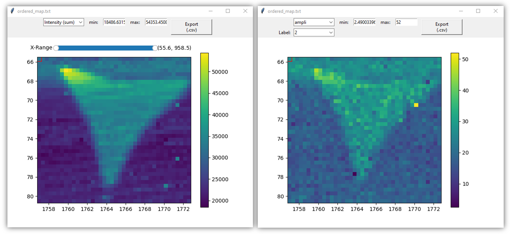

Figures
=======

Main Figure
-----------

The main Figure section displays the loaded spectra and allows manipulation of baseline and peaks models with the mouse.

The standard navigation toolbar from *Matplotlib* allows panning, zooming and saving the current figure.
The function associated with the |home|
icon has been reconfigured to allow spectra rescaling.

.. |home| image:: _static/home.png

.. figure:: _static/navigation_toolbox.png
   :align:   center

.. raw:: html

    

:code:`Figure settings` (at the top) allows personalizing plots displays, figure title, and axis labels.

.. figure::  _static/figure_settings.png
   :align:   center

.. raw:: html

    

:code:`Save All (.png)` (at the bottom) allows saving all the spectra figures in .png format. (Be cautious with 2D-maps as they can generate a large number of figures).

Note that to ease copy/paste, :code:`CTRL+C` allows putting the current figure in the clipboard (only available on Windows).

2D-map Figure
-------------

The 2D-map Figure widgets allow easy selection of spectra and interaction with the cursor selection of the files selector widget.

By default, the full range of integrated spectra intensity is displayed.
A range slider in the figure allows specifying the summation bounds.
Once peaks have been defined, the corresponding model parameters can be also visualized in the 2D-map figures.

   left: intensity field in a 2D-map figure (default mode). right: FWHM values associated to 'Peak I' (obtained after fitting).