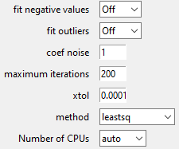

Fitting
=======

.. figure::  _static/peaks.png
   :align:   center

.. raw:: html

    

**The current frame is activated and deactivated when clicking on it.**

:code:`Auto` can be used for the automatic determination of peaks, considering the selected :code:`Peak model`.

For manual peaks positioning by the user, the :code:`Peak model` (to be chosen between **Gaussian**, **Lorentzian**, **Asymetric Gaussian**, **Asymetric Lorentzian** and **Pseudovoigt**) is applied when left-clicking in the spectrum figure. A right-click allows the removal of the nearest peak.

The available peak models are:

* **Gaussian**:
.. math::
   ampli * exp({-(x-x0)^2/(2*\sigma^2)}) \quad with \quad \sigma = fwhm / (2*\sqrt{2*log(2)})

* **Lorentzian**:
.. math::
   ampli * fwhm^2 / [4 * ((x - x0)^2 + fwhm^2 / 4)]

* **Asymetric Gaussian**:
.. math::
   (x < x0) * Gaussian(fwhm_l) +  (x ≥ x0) * Gaussian(fwhm_r)

* **Asymetric Lorentzian**:
.. math::
   (x < x0) * Lorentzian(fwhm_l) +  (x ≥ x0) * Lorentzian(fwhm_r)

* **Pseudovoigt**:
.. math::
   alpha * Gaussian + (1 - alpha) * Lorentzian

.. raw:: html

    

:code:`Fit` and :code:`Fit All` perform the fitting based on the conditions defined in the :code:`Fit Settings` widget:

.. raw:: html

    

`maximum iterations` can be used to limit the number of iterations, saving CPU time processing consequently.
(An iteration corresponds to a gradient descent attached to all the fit parameters).

Spectrum fit success or failure (related to reaching a fit convergence criterion before reaching the `maxmimum iterations`) is displayed in green or orange (resp.) in the file selector widget.

**It is worth noting that performing several successive fits on a spectrum may slightly change the fitted parameters.**

:code:`Parameters` allows the visualization of parameters values and statistics related to the fitting process.
The :code:`Parameters` widget can be used to interact with each of the spectra (deleting or labeling peak models, redefining models).
By default, all parameters are considered as free but may be fixed during the fitting using the right-handed selection boxes.

.. figure::  _static/parameters.png
   :align:   center

.. raw:: html

    

Bounds and fit constraints can be addressed by activating the dedicated selectors located at the top of the parameters widget.

**Bounding** consists in giving left and right parameters bounds. 

**Constraints** relies on expressions that can be parameters-dependent, using the prefix defined in the 2nd column. 
The example below shows how to constrain the second fitted peak to be half the amplitude of the first one.

.. figure::  _static/fit_constraint.png
   :align:   center

.. raw:: html

    

:code:`Save (.csv)` consists of saving the fitted parameters and related statistics in a
folder predefined by the user, respectively in a .csv and a .txt file using the spectrum file basename.
