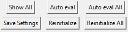

Global actions
==============

.. raw:: html

    

:code:`Show All` enables a global display of all the spectra. When clicking on the canvas with the mouse, the nearest spectra are highlighted (up to a maximum of 10 spectra).

:code:`Auto eval` and :code:`Auto eval All`  perform automatic evaluation of the baseline and peak positions and conduct fitting on the selected spectra or all the spectra (respectively).

:code:`Save settings` enables the saving of user settings in a **.fitspy.json** file located in the :code:`%HOMEUSER%` directory (refer to this file to understand the types of settings saved).

:code:`Reinitialize` and :code:`Reinitialize All` reinitialize the spectrum and all the spectra (resp.) to their original values.