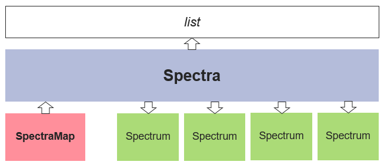

Introduction
============

What is Fitspy
--------------

`Fitspy` is a dedicated tool for spectral fitting — **and only for spectral fitting** — with the following characteristics or functionalities:

* **Agnostic Nature**: `Fitspy` is not tied to any specific physical quantity or database. It is designed to process spectra regardless of their x-support and y-intensity without requiring prior knowledge.

* **Python Implementation**: `Fitspy` is coded in Python. As a result, spectra can be easily processed using Python scripts, catering to individuals with basic knowledge of the language.

* **2D Maps**: `Fitspy` has been designed to handle spectra derived from 2D acquisitions. Note that the beyond "2D", dimensions can encompass time or any other dimension. When dealing with 2D data, an interactive map in the `Fitspy` GUI allows users to locate and select spectra of interest easily.

* **Multiprocessing Capabilities**: `Fitspy` enables spectral fit processing on multiple processors, enhancing efficiency.

* **Constrained Parameters**: Leveraging the `lmfit <https://lmfit.github.io//lmfit-py/>`_ library, `Fitspy` empowers users to impose constraints on parameter ranges or establish constraints between parameters using literal expressions.

* **Simple GUI**: `Fitspy` has been designed to be as intuitive and simple to use as possible (subjective criterion).

Therefore, the features of `Fitspy` make it an ideal tool for quickly fitting a few spectra through its GUI or for fitting several thousand of spectra (or more) by python batches.

Install and launching
---------------------

For a basic install (*ie* without the examples, tests and the related datasets)::

    pip install fitspy
    fitspy

For a full install::

    git clone https://github.com/CEA-MetroCarac/fitspy.git
    fitspy

    # examples execution
    cd fitspy/examples
    python ex0_gui_auto_decomposition.py
    python ex1_gui_reload_model.py
    ...

    # tests execution
    pip install pytest
    cd fitspy
    pytest

.. _Quick start:

Quick start
-----------

Once the `Fitspy` GUI has opened, at the right panel, from top to bottom:

    - :code:`Select` **file(s)**
    - Define the :code:`X-range`
    - Define the baseline to :code:`subtract` *(left or right click on the figure to add or delete (resp.) a baseline point)*
    - :code:`Normalize` *the spectrum/spectra*
    - **Click on the** :code:`Peaks` **panel to activate it**
    - **Select** :code:`Peak model` **and add peaks** *(left or right click on the figure to add or delete (resp.) a peak)*
    - Add a background (:code:`BKG model`) to be fitted
    - Use :code:`Parameters` to set bounds and constraints
    - :code:`Fit` **the selected spectrum/spectra**
    - :code:`Save` the parameters in `.csv` format
    - :code:`Save` the* `Model` in a `.json` file (to be replayed later)

the lines in **bold** are the strict minimum to do a spectrum fit, the other ones are optional.

How Fitspy works
----------------

The main class of Fitspy is :class:`~fitspy.spectra.Spectra` (inherited from `list`) that contains a list of  :class:`~fitspy.spectrum.Spectrum` objects.

For each of these :class:`~fitspy.spectrum.Spectrum` objects, a (x, y) profile is associated.

Additionally, 2D maps of spectra (named :class:`~fitspy.spectra_map.SpectraMap`) can be provided as input according to a dedicated format. They consist in a set of :class:`~fitspy.spectrum.Spectrum` with associated grid coordinates (see below).

The spectra processing are based on  :class:`~fitspy.baseline.BaseLine` (optional) and peaks :mod:`~fitspy.models` like Gaussian, Lorentzian, ... used to fit the spectra profiles.

**Important**: it is strongly recommended to address the spectra processing operations in the order defined in the `Quick start`_ below.

