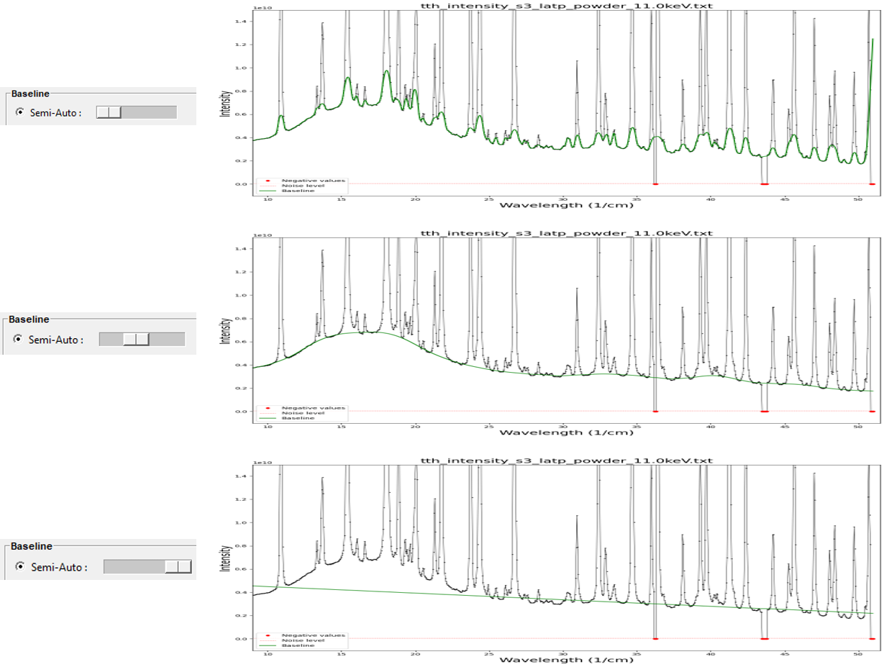

Baselines and Background models
===============================

Two approaches are available in `Fitspy` to handle **non-flattened profiles**:

* the **baseline** approach

*  the use of a **background model** during the spectra fitting

Baseline approach
-----------------

This approach involves either **manually** predefining points to establish the baseline profile that will be subtracted before fitting or a **semi-automatic** algorithm described hereafter.

Manual approach
~~~~~~~~~~~~~~~

From the baseline points, the profile all along the spectrum support is obtained by interpolation either from **piecewise** or **polynomial** approximations.

.. figure::  ../_static/gen_figures_baseline.png
   :align:   center

When setting a parameter named :code:`attached` to :code:`True`, the baseline points are attached to the corresponding spectrum intensity profile.
This feature allows to adapt the baseline points to the spectrum notably when processing a dataset of spectra that have variations in intensity.

.. figure::  ../_static/gen_figures_baseline_attached.png
   :align:   center

Note that to minimize the impact of noise in the baseline attached-points definition, a smoothing can be considered on the spectra intensities before linking. This smoothing is based on a gaussian filtering considering :code:`sigma` (in pixel) as the standard deviation.

Semi-Automatic approach
~~~~~~~~~~~~~~~~~~~~~~~

From the 2024.5, a semi-automatic algorithm is availabel to evaluate the baseline. Based on the ARPLS (Asymmetrically Reweighted Penalized Least Squares) approach described `here <https://doi.org/10.1039/C4AN01061B>`_. The user only needs to visually adjust the smoothing coefficient that seems most likely to bring the baseline closest to the desired result.

Background model
----------------

The background model approach consists in selecting a **BKG model** that is taken into account with the peak models during the fit processing.

.. figure::  ../_static/gen_figures_bkg.png
   :align:   center

The available predefined **BKG models** are :code:`Constant`, :code:`Linear`, :code:`Parabolic`, :code:`Exponential`, :code:`PowerLaw` related to the `lmfit` standard models defined `here <https://lmfit.github.io/lmfit-py/builtin_models.html>`_.

Note that all the `lmfit` standard models (that make sense for background) can be added from a *'.py'* file according to the *User-defined background models* approach described just below. Example::

    from lmfit.models import PolynomialModel, SplinelModel
    from fitspy import BKG_MODELS

    BKG_MODELS.update({"Polynomial": PolynomialModel})
    BKG_MODELS.update({"Spline": SplinelModel})

User-defined background models
~~~~~~~~~~~~~~~~~~~~~~~~~~~~~~

User-defined models can be defined through literal expressions in a *'.txt'* file or from python scripts in a *'.py'* file.

Example of two models defined by literal expressions::

    Linear_1 = slope * x + intercept
    Exponential_1 = ampli * exp(-coef * x)

Example of two models defined in python::

    import numpy as np
    from fitspy import BKG_MODELS

    def linear(x, slope, constant):
        return slope * x + constant

    def exponential(x, ampli, coef):
        return ampli * np.exp(-coef * x)

    BKG_MODELS.update({"Linear_2": linear})
    BKG_MODELS.update({"Exponential_2": exponential})

Through the GUI, the corresponding *'.txt'* or *'.py'* files can be loaded via the button :code:`Load` located to the right of the **BKG model** combobox.

In python, the users models can be loaded by the related functions :func:`~fitspy.utils.load_models_from_txt` and :func:`~fitspy.utils.load_models_from_py`.
*(See example in* `ex_gui_users_defined_models_2d_map.py <https://github.com/CEA-MetroCarac/fitspy/tree/main/examples/ex_gui_users_defined_models_2d_map.py>`_ *)*

For recurrent use, the user-defined models can be defined in files named :code:`bkg_models.txt` or :code:`bkg_models.py` to put in :code:`%HOMEUSER%/Fitspy` (typically C:\\Users\\my_account\\Fitspy in Windows and /home/Fitspy in Linux).

The variable associated with the support must necessarily be used in expressions under the term :code:`x` and the mathematical functions must be designated according to the terminology defined in the `asteval <https://newville.github.io/asteval/basics.html#built-in-functions>`_ package.

Note that in the examples given above, the resulting :code:`Linear_1`, :code:`Linear_2` models yield identical results to those obtained from the predefined :code:`Linear` model, when converged.
The same for :code:`Exponential_1`, :code:`Exponential_2` and :code:`Exponential`.

.. warning::
    Unlike predefined models, user-defined models do not have associated functions to determine their initial values for the fitting.

    **All the parameters are initialized to 1.** This can lead to wrong convergence.

    To prevent this, it is advisable to review the model parameters using appropriate multiplier coefficients.

    Example: for a x-range in [0, 1000], the Exponential functions should be rather defined as :code:`ampli * exp(-coef * x / 1000)`
