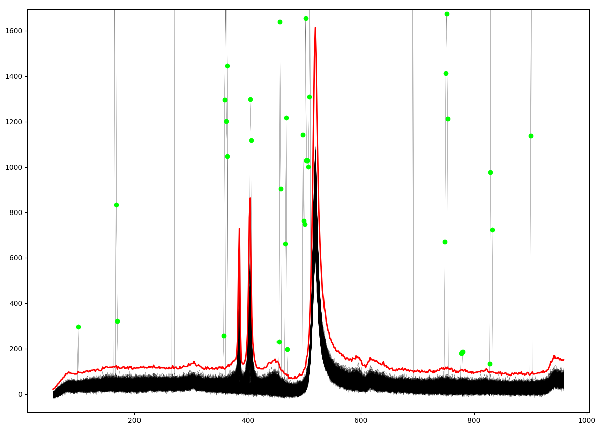

Fitting
=======

The fitting processing is performed using the methods provided by the `lmfit <https://lmfit.github.io//lmfit-py/>`_ package.

However, to facilitate the convergence of the fitting process, the signal can be pre-processed to subsequently distinguish between noise or outliers and 'physical' signal.

Noise level
-----------

After **baseline subtraction**, to avoid spending time in fitting peak models amidst noise, models in the 'noisy regions' are disabled.

A global noise level associated to each spectrum is first estimated (as the median of the absolute amplitudes of oscillating parts of the spectrum).

All peaks models located in areas below this noise level (multiplied by a user coefficient) are disabled and all the associated parameters (except :code:`x0`) are set to 0.

Outliers
--------

To determine outliers, a certain number of spectra of the same nature are required in order to be able to deduce numerically abnormal amplitude variations. This is well-suited particularly for 2D-map spectra.

First, a 'normal spectra' envelop is determined from the values of the 5th maximum intensity of all the spectra at any point (considering a null probability of having more than 5 outliers at the same point).

Outliers are then determined as points exceeding this envelope by a certain coefficient.

In the fit processing, outliers have a null weight associated with them (see below), and at the preceding baseline definition step, linear interpolations of the signal with respect to the points surrounding these outliers are performed.

   Illustration for a 2D-map spectra of the 'normal spectra' envelop (in red line) with coefficient 1.5, and resulting outliers (in green dots).

Fitting parameters
------------------

Fitting algorithm
~~~~~~~~~~~~~~~~~

In the GUI, the pre-selected fitting algorithms  are :code:`Leastsq`, :code:`Least_squares`, :code:`Nelder-Mead`, :code:`SLSQP` which correspond in **`lmfit`** to the *'leastsq', 'least_squares', 'nelder'* and *'slsqp'* fitting algorithms (resp.).

In python script, all the allowed **`lmfit`** fitting algorithms can be used via the :code:`method` argument passed to :func:`~fitspy.spectrum.Spectrum.fit`.

Convergence criterion
~~~~~~~~~~~~~~~~~~~~~

The convergence criterion is most often associated with a threshold to be reached on the calculated residual during the minimization procedure (gradient descent). Each fitting method used by **`lmfit`** has its own way of specifying this criterion.
For :code:`Leastsq` and :code:`Least_squares` the :code:`xtol` parameter can be pass to the fit function (see the `scipy <https://docs.scipy.org/doc/scipy/reference/generated/scipy.optimize.least_squares.html>`_ documentation for more details about this parameter). Otherwise, for the other fitting methods, in scripting mode, tolerance criteria can be passed through the :code:`fit_kws` in the :code:`kwargs` arguments of the :func:`~fitspy.spectrum.Spectrum.fit` function (in a format compatible with the fit method).

This convergence criterion naturally has a significant impact on performance. (Refer to the section `above <fitting.html#performance>`_).

Maximum number of iterations
~~~~~~~~~~~~~~~~~~~~~~~~~~~~

This number, which corresponds to the maximum number of calls of the gradient descent process, is set by default to 200. It can be beneficial, when fitting numerous spectra, to decrease this value to save computation time, ensuring it does not significantly compromise the quality of the fits. Sometimes, just a few dozen iterations are indeed sufficient.

In the GUI, when the maximum number is reached without meeting the convergence criterion, the fit result is labeled as 'non-converged' and is displayed with an orange banner in the files selector widget. In case of convergence, the banner turns green.

Mask and Weights
~~~~~~~~~~~~~~~~

Similarly to noisy areas of outliers, the presence of negative values in the profiles to be fitted, resulting notably from baseline or background removal, can adversely affect the quality of results. To mitigate the impact of these negative values during the fit, a mask to ignore them during the fit processing can be assigned to these values. This is achieved through the **'fit negative values : Off'** option in the GUI or by the :code:`fit_negative` parameter passed to :func:`~fitspy.spectrum.Spectrum.fit`.

(The same with :code:`fit_outliers` for outliers and :code:`coef_noise` to bypass regions defined mainly by noise).

Moreover, from the 2025.4, `weights <https://lmfit.github.io/lmfit-py/model.html#lmfit.model.weights>`_ (related to uncertainties measurements for instance) can be set via the input data files. See `here <input_data.html#d-spectrum>`_.

Multi-threading
~~~~~~~~~~~~~~~

In the GUI, the default mode is **'Number of CPU : auto'** which adapts automatically the number of CPU to the number of profiles to be processed and the CPU capability of the machine (by utilizing up to half of the available CPU resources).

Parameters values initialization
~~~~~~~~~~~~~~~~~~~~~~~~~~~~~~~~

Also known as the **Guess init** step, the initial values assigned to the models parameters are crucial in the subsequent process of minimizing residuals through gradient descent. When poorly adapted to the profiles to be fitted, they can lead to inappropriate results (local minima), or even prevent the gradient descent. This is why the predefined models in Fitspy have their own methods for evaluating such initial values. The use of **user-defined models** without these methods and where all parameters are initialized to 1, can thus lead to bad convergence.

.. note::
    It is possible that repeated actions of fits on a 'converged profile' may lead to small variations.

Constraints settings
--------------------

Models parameters fixing
~~~~~~~~~~~~~~~~~~~~~~~~

Each parameters can be set to free (default) or not during the fit processing. Fixing the parameters is achieved in the GUI by activating the boxes located to the right of each parameter.

Models parameters bounding
~~~~~~~~~~~~~~~~~~~~~~~~~~

For each parameter, a range can be assigned for the fit processing. For the :code:`peaks models` parameters, these ranges are defined at certain default values. In the GUI, these ranges can be adjusted through the :code:`Parameters` widget by activating the  :code:`show bounds` box.

Models parameters coupling
~~~~~~~~~~~~~~~~~~~~~~~~~~

Similarly, in the :code:`Parameters` widget, constraints can be associated with each parameter, by activating the :code:`show expressions` box and providing the constraints as explained `here <gui.html#fitting>`_.

Performance
-----------

The performance varies depending on factors such as the number of spectra to handle, the number of points per spectrum, the number of peaks to fit, the :code:`xtol` convergence criterion,... and, of course, the machine 's performance, including its multiprocessing capabilities.

Here is an example of the performance obtained from applying the `Fitspy` `model.json <https://github.com/CEA-MetroCarac/fitspy/blob/main/examples/data/2D_maps/model.json>`_ (which includes the baseline removal and fitting 5 peak models per spectrum) to all **1520 spectra** related to the example `ex_gui_users_defined_models_2d_map.py <https://github.com/CEA-MetroCarac/fitspy/tree/main/examples/ex_gui_users_defined_models_2d_map.py>`_.

.. list-table:: Performance
   :widths: 25 50 5 5
   :header-rows: 1
   :align: center

   * - Machine
     - Number of processors
     - :code:`xtol`
     - CPU time (s)
   * - PC Windows
     - 8 (Intel(R) Core(TM) i5-10400H CPU @ 2.60GHz)
     - 0.01
     - 175
   * - Windows server
     - 36 (Intel(R) Xeon(R) Gold 6154 CPU @ 3.00GHz)
     - 0.01
     - 6
   * - Windows server
     - 36 (Intel(R) Xeon(R) Gold 6154 CPU @ 3.00GHz)
     - 0.001
     - 10
   * - Windows server
     - 36 (Intel(R) Xeon(R) Gold 6154 CPU @ 3.00GHz)
     - 0.0001
     - 18