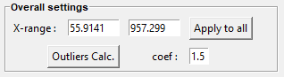

GUI description
===============

.. note::
    As of 2025, both GUIs (Tkinter and PySide) offer nearly identical features. Consequently, the descriptions below primarily refer to the Tkinter GUI. Any specificities of the PySide GUI will be detailed where applicable.

Files selection
---------------

The files selection is realized with the following widget:

.. figure::  ../_static/tkinter/files_selector.png
   :align:   center

.. raw:: html

    

:code:`Select Files` enables to load spectra (as '.txt' files) selected individually or by block while :code:`Select Dir.` loads all spectra that are contained in a selected directory.

**2D-map**: Once loaded in the GUI, if `Fitspy` detects that a '.txt' file corresponds to a 2D-map input data file (via the tabulation :code:`\t` as first character), this one is expanded.
That is to say that each spectrum of the 2D-map appears individually in the files selection widget according to the 2D-map file basename and the (X) and (Y) spectrum coordinates in the grid as prefix::

    {basename}  X={X} Y={Y}

A  2D-map figure is also opened to facilitate both the spectrum selection and the interaction with the files selector widget. Additionally, it allows to see the fit parameters in 2D displaying.

.. figure::  ../_static/2d-map.png
   :align:   center
   :width:   50%

   interactive 2D-map figure resulting from this `fully defined ordered acquisition grid <https://github.com/CEA-MetroCarac/fitspy/tree/main/examples/data/2D_maps/ordered_map.txt>`_

Global actions (Tkinter)
------------------------

.. figure::  ../_static/tkinter/global_actions.png
   :align:   center

.. raw:: html

    

:code:`Show All` enables a global display of all the spectra. When clicking on the canvas with the mouse, the nearest spectra are highlighted (up to a maximum of 10 spectra).

:code:`Auto eval` and :code:`Auto eval All`  perform automatic evaluation of the baseline and peak positions and conduct fitting on the selected spectra or all the spectra (respectively).

:code:`Save settings` enables the saving of user settings in a **settings.json** file located in the :code:`%HOMEUSER%/Fitspy` directory (open this file to have a look on which and how settings are saved).

:code:`Reinitialize` and :code:`Reinitialize All` reinitialize the spectrum and all the spectra (resp.) to their original values.

   Example of the global display obtained with :code:`Show All`

Overall settings
----------------

.. raw:: html

    

:code:`X-range` allows the modification of the (x) support range associated with the current spectrum.

:code:`Apply to All`  applies the (x) support range defined in `X-range` to all the spectra.

:code:`Outliers Calc` allows defining a line (called in `Fitspy` **outliers_limit**) from which values above are considered as outliers.
This line is defined as corresponding to the envelope of the spectra multiplied by the :code:`coef` factor.
Consequently, the spectra loaded at the time of defining this line must be consistent with each other. (See `here <fitting.html#outliers>`_ for more details).

.. note::
    In the **PySide GUI**, the outliers envelop parameters settings and calculation are perform from the :code:`More settings` panel

Baseline
--------

.. figure::  ../_static/tkinter/baseline.png
   :align:   center

.. raw:: html

    

**The current frame is activated and deactivated when clicking on it.**

:code:`Semi-Auto` allows a semi-automatic baseline determination based on the ARPLS (Asymmetrically Reweighted Penalized Least Squares) approach described `here <https://doi.org/10.1039/C4AN01061B>`_. The user only needs to adjust the smoothing coefficient with the slider beside that seems most likely to bring the baseline closest to the desired result.

:code:`Import` enables the user to import their own baseline profiles. The imported file should contain 2 columns associated with the (x,y) coordinates of the baseline points.
Similar to spectrum profiles, the separators between the columns can be tabulation :code:`\t`, comma :code:`,`, semicolon :code:`;` or space :code:`\ `.
Note that the first row is skipped, and the (x, y) rows can be unordered.

:code:`Auto` can be used for the automatic determination of baseline points, considering the :code:`Min distance` (minimum distance) between two consecutive points (in pixels).

:code:`Attached` makes the baseline attached to either the raw spectrum profile or a smoothed one derived from Gaussian filtering applied to the raw spectrum profile, using :code:`Sigma` as the standard deviation (in pixels).

Baseline profiles are defined either through :code:`Linear` piecewise or :code:`Polynomial` approximation, considering the specified :code:`Order`.
It's important to note that a '*n*'-order polynomial approximation requires at least '*n+1*' points to be satisfied.

Normalization
-------------

.. raw:: html

    

An **optional** spectra normalization is offered and relies on the two following strategies:

* :code:`Maximum`: when activated, each spectrum is normalized to 100 based on its maximum intensity on the :code:`X-range` specified by the user. (None-None refers to no upper and lower x-range delimitation, that is to say all the support is considered).

Fitting
-------

.. raw:: html

    

**The current frame is activated and deactivated when clicking on it.**

:code:`Auto` can be used for the automatic determination of peaks, considering the selected :code:`Peak model`.

For manual peaks positioning by the user, each :code:`Peak model` (to be chosen between **Gaussian**, **Lorentzian**, **Asymetric Gaussian**, **Asymetric Lorentzian**, **Pseudovoigt** or as a **user-defined model**, see `here <peak_models.html>`_) is applied when left-clicking in the figure. (A right-click in the figure removes the nearest peak).

:code:`Fit Selec.` and :code:`Fit All` perform the fitting based on the conditions defined in the :code:`Fit Settings` widget for the **Tkinter GUI** and in the :code:`More Settings` for the **PySide GUI**:

.. figure::  ../_static/tkinter/fit_settings.png
   :align:   center

.. raw:: html

    

:code:`maximum iterations` and :code:`xtol` can be used to limit the number of iterations, saving CPU time processing consequently.
(An iteration corresponds to a gradient descent attached to all the fit parameters).

Spectrum fit success or failure (related to reaching a fit convergence criterion before reaching the `maxmimum iterations`) is displayed in green or orange (resp.) in the file selector widget.

**It is worth noting that performing several successive fits on a spectrum may slightly change the fitted parameters.**

:code:`Stats` opens a frame that reports the statistics related to the fitting process.

The :code:`Parameters` widget can be used to interact with each of the spectra (deleting or labeling peak models, redefining models, ...).
By default, all parameters are considered as free but may be fixed during the fitting using the right-handed selection boxes.

.. figure::  ../_static/tkinter/parameters.png
   :align:   center

.. raw:: html

    

Bounds and fit constraints can be addressed by activating the dedicated selectors located at the top of the parameters widget.

**Bounding** consists in giving left and right parameters bounds.

**Constraints** relies on literal expressions that can be parameters-dependent, using the prefix defined in the 2nd column.
The example below shows how to constrain the second fitted peak to be half the amplitude of the first one.

.. raw:: html

    

:code:`Save Results` consists of saving the fitted parameters and related statistics in a folder predefined by the user, respectively in a .csv and a .txt file using the spectrum file basename (See `here <outputs.html#fit-results>`_  for more details).

Models (Tkinter GUI)
--------------------

.. figure::  ../_static/tkinter/models.png
   :align:   center

.. raw:: html

    

The **Models** frame is used to save and replay a full spectra processing as-is.

:code:`Save Selec.` or :code:`Save All` allows saving the spectra processing associated with the selected spectra in the files selection widget, or with all the spectra (resp.).

:code:`Reload` replays exactly the spectra processing related to the imported *.json*.
This implies that all the files defined in the *.json*  are reachable when reloading.

:code:`Load Model` consists of reloading the first spectrum model (baseline and peaks definition, ...) but **not the spectrum file itself**, related to the first model saved in the *.json*.

:code:`Apply to Sel.` or :code:`Apply to All` allows applying **strictly** *(ie without considering the parameters defined in the GUI)* the loaded model to the spectra selected in the files selection widget, or to all the spectra (resp.).

Models (PySide GUI)
-------------------

TODO

Main Figure
-----------

The main Figure widget displays the loaded spectra and allows manipulation of baseline and peaks models with the mouse.

The standard navigation toolbar from *Matplotlib* allows panning, zooming and saving the current figure.
In the Tkinter GUI, the function associated with the |home| icon has been reconfigured to allow the figure rescaling on the current displayed spectrum.

.. |home| image:: ../_static/home.png

.. figure:: ../_static/navigation_toolbox.png
   :align:   center

.. raw:: html

    

:code:`Figure settings` (at the top for the **Tkinter GUI**) and :code:`View Options` (below the figure for the **PySide GUI**) allow personalizing plots displays, figure title, and axis labels (TO ADAPT for PySide).

.. raw:: html

    

:code:`Save All (.png)` (at the bottom) allows saving all the spectra figures in .png format. (Be cautious with 2D-maps as they can generate a large number of figures).

Note that to ease copy/paste, :code:`CTRL+C` allows putting the current figure in the clipboard. **(Only available on Windows).**

2D-map Figures
--------------

The 2D-map Figure widgets allow easy selection of spectra and interaction with the cursor selection of the files selector widget.

By default, the full range of integrated spectra intensity is displayed with a range slider in the figure that allows specifying the summation bounds.

Once fitted, the parameters values can be visualized in the 2D-map figures.

All the maps displayed in the 2D-map Figure can be exported in a .csv file by clicking on the :code:`Export (.csv)` button.

.. figure:: ../_static/2d-map_intensity_fwhm.png
   :align:   center

   left: intensity field in a 2D-map figure (default mode). right: amplitude values associated to the 2nd peak (obtained after fitting).