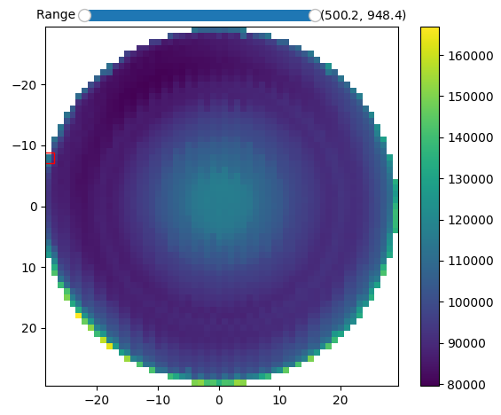

Input data files
================

Two types of input data can be interpreted:

    - basic single **1D-spectrum**
    - **2D map** spectra

.. note::
    From the 2024.5, it is possible to load **.dm3, .dm4, .emd, .hspy, .nxs** files and many other formats thanks to the **rosettasciio** readers integration (see `here <https://hyperspy.org/rosettasciio/user_guide/supported_formats/index.html#supported-formats>`_ for more details about the readable formats).

    From the 2025.4, **HDF**-based files (**.h5, .h4, .hdf**) related to NXCanSAS format can be read.

1D-spectrum
-----------

The input data file format for a single spectrum is based on 2 columns representing the support (x) - typically associated to wavelengths or energies - and the spectrum intensity (y).

The separators between the columns can be tabulation :code:`\t`, comma :code:`,`, semicolon :code:`;` or space :code:`\ `.

Note that **the first row is skipped** and the (x, y) rows can be unordered.

Example of input data file::

    #Wave       #Intensity
    958.468750	307.873749
    956.974609	292.814697
    955.480469	327.923798
    953.984375	307.819580
    952.490234	314.483063
    950.996094	322.817566
    949.501953	329.477692
    948.005859	312.723724
    946.511719	321.054932
    945.015625	346.104187
    ...

(Full 1D data files can be found `here <https://github.com/CEA-MetroCarac/fitspy/tree/main/examples/data/spectra_1/>`_.)

From the 2025.4, `weights <https://lmfit.github.io/lmfit-py/model.html#lmfit.model.weights>`_ used during the fit processing can be set via a third and optional column::

    #Wave       #Intensity  #Weights
    958.468750	307.873749  2.82
    956.974609	292.814697  3.01
    955.480469	327.923798  0.25
    953.984375	307.819580  2.96
    ...

2D-map spectra
--------------

This second type is generally associated with **2D-map** acquisitions.

The related format is based on a first line related to the support (x) of the spectra and starts with 2 tabulations :code:`\t`.

The subsequent rows are related to the spectra intensity at the 'pixel' coordinates (X), (Y) defined in the first 2 columns.
**The number of intensity values defined at each row must be consistent with the support (x) defined in the first row**.
The X-Y spectra can be defined in a partial and unordered 2D grid.

Note that (X) and (Y) are not necessary related to spacial dimensions. They can refer to any other dimensions like time, a study parameter ...

Example of 2D-map input data::

    \t  \t  958.468750  956.974609  955.480469  953.984375  952.490234  ...
    0.  0.  307.873749  292.814697  327.923798  307.819580  314.483063  ...
    1.  0.  308.425364  291.142875  320.452365  305.234865  312.325687  ...
    2.  0.  306.325648  291.235672  324.834579  306.378541  312.387649  ...
    ...
    8.  10. 307.873749  292.814697  327.923798  307.819580  314.483063  ...
    9.  10. 308.425364  291.142875  320.452365  305.234865  312.325687  ...
    10. 10. 306.325648  291.235672  324.834579  306.378541  312.387649  ...

(Full 2D-map data files can be found `here <https://github.com/CEA-MetroCarac/fitspy/tree/main/examples/data/2D_maps/>`_).

   Illustration of a partially unordered 2D map issued from `unordered_map.txt <https://github.com/CEA-MetroCarac/fitspy/tree/main/examples/data/2D_maps/unordered_map.txt>`_