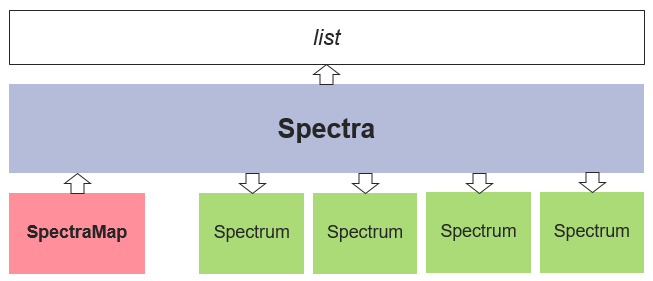

Introduction
============

What is Fitspy
--------------

`Fitspy` is a dedicated tool for spectral fitting — **and only for spectral fitting** — with the following characteristics:

* **Agnostic Nature**: `Fitspy` is not tied to any specific physical quantity or database. It is designed to process spectra regardless of their x-support and y-intensity without requiring prior knowledge.

* **Python Implementation**: `Fitspy` is coded in Python. As a result, spectra can be easily processed using Python scripts, catering to individuals with basic knowledge of the language.

* **User Models**: `Fitspy` allows users to input their own models either in the form of literal expressions (for simple models) or through Python scripts (for more complex models).

* **2D Maps**: `Fitspy` has been designed to handle spectra derived from 2D acquisitions. Note that the beyond "2D", dimensions can encompass time or any other dimension. When dealing with 2D data, an interactive map in the `Fitspy` GUI allows users to locate and select spectra of interest easily.

* **Multiprocessing Capabilities**: `Fitspy` enables spectral fit processing on multiple processors, enhancing efficiency.

* **Constrained Parameters**: Leveraging the `lmfit <https://lmfit.github.io//lmfit-py/>`_ library, `Fitspy` empowers users to impose constraints on parameter ranges or establish constraints between parameters using literal expressions.

* **Noise level and outliers detection**: `Fitspy` evaluates the background noise of the signal and helps avoid (in a certain scope of use) spending time fitting regions corresponding to simple noise. The same applies regarding outliers (which, for example, could correspond to cosmic rays in certain acquisition domains).

* **Simple GUI**: `Fitspy` has been designed to be as intuitive and simple to use as possible (subjective criterion).

Therefore, the features of `Fitspy` make it an ideal tool for quickly fitting a few spectra through its GUI or for fitting several thousand of spectra (or more) by python batches.

Install and launching
---------------------

.. note::
    Since its 2025.1 version, Fitspy can be launched using two interfaces: one corresponds to the original GUI built with **Tkinter**, and the other, more recent one, developed using **PySide** with more 'flexibility'. As of 2025, both GUIs offer nearly identical features, but future efforts regarding fixes and updates will primarily focus on the **PySide** GUI.

if python is not already installed in your PC:

    * Download a python.exe from `<https://www.python.org/downloads/>`_
    * Launch the python.exe (ensure to check the box **Add python.exe to PATH** before proceeding with the installation)

in a command prompt (like **cmd** or **powershell**, accessible from the Windows search bar):

* For a **basic install/upgrade** and launching::

    pip install fitspy --upgrade
    fitspy # to launch the advanced GUI based on PySide
    fitspy-tk # to launch the primary GUI based on Tkinter

*(If an error message is returned upon executing the first line, it likely indicates that python.exe is not included in your PATHs. In this case, (re)launch your python.exe and choose "modify" to select* **Add python.exe to PATH**)

* For a **full install** with data sets, examples and tests (requiring `git <https://git-scm.com/downloads>`_)::

    git clone https://github.com/CEA-MetroCarac/fitspy.git
    fitspy # advanced GUI based on PySide
    fitspy-tk # primary GUI based on Tkinter

    # examples execution
    cd fitspy/examples
    python ex_gui_auto_decomposition.py
    python ex_gui_reload_model.py
    ...

    # tests execution
    pip install pytest
    cd fitspy
    pytest

.. _Quick start:

Quick start
-----------

Once the `Fitspy` GUI has opened,

PySide GUI :
~~~~~~~~~~~~

The strict minimum operations (in red) for a spectrum fitting consists of:

- (`1 <files_selection.html>`_) **Select file(s) using drag an drop mode** (in the right panel)
- (`2 <fitting.html>`_) **Select a** :code:`Peak model`
- (`3 <fitting.html>`_) **After clicking on** :code:`Peaks points`, **Select them on the main figure** *(with left/right click on the figure to add/delete a peak point)*
- Repeat the last two actions as needed
- (`5 <fitting.html>`_) :code:`Fit` **the spectrum/spectra selected in the files selector widget**
- (`10 <fitting.html>`_) **Save results** (**fitted parameters** and **statistics**)

.. figure::  ../_static/pyside/workflow.png
   :align:   center
   :width:   80%

.. raw:: html

    

*(The entire workflow is described* `here <workflow.html>`_ *).*

Tkinter GUI :
~~~~~~~~~~~~

from top to bottom of the right panel, the strict minimum operations (in red) for a spectrum fitting consists of:

- (`1 <files_selection.html>`_) **Select file(s) from** :code:`Select Files`  **or**  :code:`Select Dir`
- (`5 <fitting.html>`_) **Click on the** :code:`Fitting` **panel to activate it (if not)**
- (`6 <fitting.html>`_) **Select a** :code:`Peak model`
- (`7 <fitting.html>`_) **Select a peak point on the main figure** *(with left/right click on the figure to add/delete a peak point)*
- Repeat the last two actions as needed
- (`10 <fitting.html>`_) :code:`Fit Selec.` **the spectrum/spectra selected in the files selector widget or** :code:`Fit All` **the spectra**
- (`11 <fitting.html>`_) :code:`Save Results` (**fitted parameters** and **statistics**)

.. figure::  ../_static/tkinter/workflow.png
   :align:   center
   :width:   300

.. raw:: html

    

*(The entire workflow is described* `here <workflow.html>`_ *).*

How Fitspy works
----------------

The main class of Fitspy is :class:`~fitspy.spectra.Spectra` (inherited from `list`) that contains a list of  :class:`~fitspy.spectrum.Spectrum` objects.

For each of these :class:`~fitspy.spectrum.Spectrum` objects, a (x, y) profile is associated. (More details `here <files_selection.html?2D-map_spectra=#d-spectrum>`_).

Additionally, 2D maps of spectra (named :class:`~fitspy.spectra_map.SpectraMap`) that consist in a set of :class:`~fitspy.spectrum.Spectrum` with associated grid coordinates can be provided as input according to a dedicated format. (More details `here <files_selection.html?2D-map_spectra=#d-map-spectra>`_).

The spectra processing are based on  :class:`~fitspy.baseline.BaseLine` (optional) and peaks :mod:`~fitspy.models` like Gaussian, Lorentzian, ... used to fit the spectra profiles.

