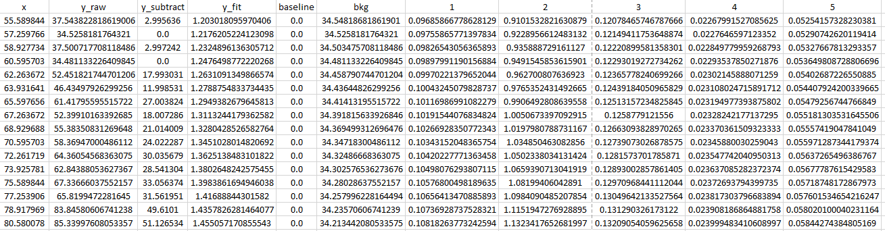
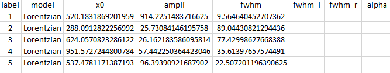
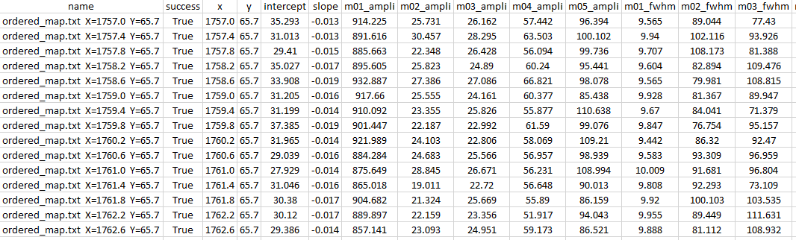
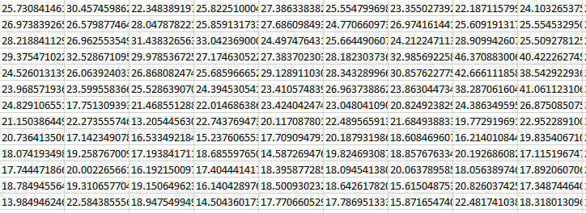

Outputs
=======

Fitspy provides two types of outputs:

* those related to the **models**,

* and those related to the fits (**parameters** of the fitted models, **statistics** and **profiles** (raw and fitted spectrum, baseline, background and peak decomposition).

Outputs models
--------------

The **output models** consist of .json files in which all parameters of the spectrum and spectra objects have been saved so as to be able:

* either to recreate the previously obtained results **identically**

* or to apply the first spectrum model to other data sets (without considering the :code:`fname` value)::

    {
       "0": {
          "fname": "../examples/data/spectra_2/spectrum_2_1.txt",
          "range_min": 200.0,
          "range_max": 957.299,
          "normalize": true,
          "normalize_range_min": 670.0,
          "normalize_range_max": 700.0,
          "models_labels": ["", "Peak IV", "Peak II", "", "", "Peak I", "Peak III", "", ""],
          "bkg_model": null,
          "fit_method": "Leastsq",
          "fit_negative": true,
          "max_ite": 200,
          "attached": true,
          "baseline": {
             "points": [[201.1400035483871, 954.8547838709676], [164.91378720565154, 228.197032967033]],
             "mode": "Linear",
             "order_max": 2,
             "distance": 100,
             "sigma": 0,
             "attached": true,
             "is_subtracted": true
          },
          "models": {
             "0": {
                "Lorentzian": {
                   "ampli": {
                      "value": 377.8408958125738,
                      "min": 0,
                      "max": Infinity,
                      "vary": 1,
                      "expr": null
                   },
                   "x0": {
                      "value": 342.94548419455225,
                      "min": 322.195,
                      "max": 362.195,
                      "vary": 1,
                      "expr": null
                   },
                   "fwhm": {
                      "value": 2.643513972868272,
                      "min": 0,
                      "max": 200,
                      "vary": 1,
                      "expr": null
                   }
                }
             },
             "1": {
                "Lorentzian": {
                   "ampli": {
                      "value": 98.30555093353449,
                      "min": 0,
                      "max": Infinity,
                      "vary": 1,
                      "expr": null
                   },
                   ...
             },
             ...

Fit results
-----------

Once fitted, a spectra data set can generate several files related to the fitting statistics and the fitted parameters.

In a 'results' directory (to be specified by the user), the **statistics** and **profiles** files are built when clicking on :code:`Save Results` in the GUI, according to the following model: {spectrum basename}**_stats.txt** and {spectrum basename}**_profiles.txt** file respectively).

The same for the **fitted parameters** attached to each spectrum: {spectrum basename}**.csv** file)

* Example of **statistics** returned in *ordered_map.txt  X=1757.0  Y=65.7_stats.txt* (obtained from *examples/ex_gui_users_defined_models_2d_map.py*)::

    [[Fit Statistics]]
    # fitting method   = leastsq
    # function evals   = 93
    # data points      = 575
    # variables        = 17
    chi-square         = 112158.281
    reduced chi-square = 201.000503
    Akaike info crit   = 3066.14539
    Bayesian info crit = 3140.16968
    R-squared          = 0.97525302
    [[Variables]]
    m01_ampli:  914.225148 +/- 10.5474510 (1.15%) (init = 950.0121)
    m01_fwhm:   9.56464045 +/- 0.20679661 (2.16%) (init = 9.594399)
    m01_x0:     520.183187 +/- 0.05449477 (0.01%) (init = 520.1866)
    m02_ampli:  25.7308415 +/- 3.15171955 (12.25%) (init = 44.85308)
    m02_fwhm:   89.0443082 +/- 20.7241979 (23.27%) (init = 88.40916)
    ...
    slope:     -0.01339502 +/- 0.00379213 (28.31%) (init = -0.01434605)
    intercept:  35.2928118 +/- 2.39248326 (6.78%) (init = 35.87932)
    [[Correlations]] (unreported correlations are < 0.100)
    C(slope, intercept)     = -0.8110
    C(m02_fwhm, intercept)  = -0.6385
    C(m04_fwhm, m04_x0)     = +0.6378
    C(m01_fwhm, m05_x0)     = +0.5982
    C(m01_fwhm, m05_fwhm)   = -0.5258
    C(m05_fwhm, m05_x0)     = -0.5191
    ...

* Example of the **profiles** in *ordered_map.txt  X=1757.0  Y=65.7_profiles.csv*:

.. raw:: html

    

* Example of the **fitted parameters** in *ordered_map.txt  X=1757.0  Y=65.7.csv*:

.. raw:: html

    

Also, a file, named **results.csv**, that concatenates all the parameters (ordered by names) of all the fitted spectra, is automatically generated when clicking on :code:`Save Results` in the GUI.

* Example of *results.csv* (extract):

.. raw:: html

    

Finally, when dealing with 2d-map spectra, the button :code:`Export` enables to write the current displayed data in a .csv file as: {spectrum basename}_{parameter name}_{label}.csv file.

* Example of *ordered_map_ampli_2.csv* (extract):

