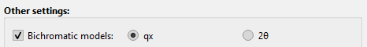

Peak models
===========

As for the background models, the peak models in `Fitspy` are issued either from **predefined models**, or by **user-defined models**.

Predefined models
-----------------

The predefined peak models available in `Fitspy` relies on the following parameters:

- :math:`x0` : the peak position
- :math:`ampli` : the peak amplitude
- :math:`fwhm` : the Full Width at Half Maximum
- :math:`fwhm_l` : the `fwhm` at the left side of `x0` (for the asymmetric models)
- :math:`fwhm_r` : the `fwhm` at the right side of `x0` (for the asymmetric models)
- :math:`alpha` : weighting coefficient (used in the Pseudovoigt model)

Gaussian
~~~~~~~~

.. math::
   ampli * exp({-(x-x0)^2/(2*\sigma^2)}) \quad with \quad \sigma = fwhm / (2*\sqrt{2*log(2)})

Lorentzian
~~~~~~~~~~

.. math::
   ampli * fwhm^2 / [4 * ((x - x0)^2 + fwhm^2 / 4)]

Asymetric Gaussian
~~~~~~~~~~~~~~~~~~

.. math::
   (x < x0) * Gaussian(fwhm_l) +  (x ≥ x0) * Gaussian(fwhm_r)

Asymetric Lorentzian
~~~~~~~~~~~~~~~~~~~~

.. math::
   (x < x0) * Lorentzian(fwhm_l) +  (x ≥ x0) * Lorentzian(fwhm_r)

Pseudovoigt
~~~~~~~~~~~

.. math::
   alpha * Gaussian + (1 - alpha) * Lorentzian

Bichromatic models
------------------

In the case of bichromatic sources, as used for example in **XRD** or **XRF**, predefined double-peak models has been set for Cu, Mo, Ag and Co cathodes (see `here <https://cea-metrocarac.github.io/fitspy/api/fitspy.core.html#module-fitspy.core.models_bichromatic>`_), considering:

:math:`x`, `x0` : the x-support and the peak position in consistent coordinates (2θ angle in degrees or qx)

For other cathodes, the users can define their own models through the approach described below.

User-defined models
-------------------

As for the background, users models can be defined through literal expressions in a *'.txt'* file or from python scripts in a *'.py'* file.

Example of a model defined by a literal expression::

    Gaussian_1 = ampli * exp(-(x - x0) ** 2 / (fwhm**2 / (4 * log(2))))

Example of a model defined in python::

    import numpy as np
    from lmfit.models import GaussianModel
    from fitspy import PEAK_MODELS

    LMFIT_GAUSSIAN_MODEL = GaussianModel()

    def gaussian_2(x, ampli, fwhm, x0):
        sigma = fwhm / (2. * np.sqrt(2. * np.log(2.)))
        coef = 1. / (2 * sigma ** 2)
        return ampli * np.exp(-coef * (x - x0) ** 2)

    def gaussian_3(x, x0, ampli, fwhm):
        sigma = fwhm / (2. * np.sqrt(2. * np.log(2.)))
        return sigma * np.sqrt(2. * np.pi) * LMFIT_GAUSSIAN_MODEL.eval(x=x, center=x0, amplitude=ampli, sigma=sigma)

    PEAK_MODELS.update({"Gaussian_2": gaussian_2})
    PEAK_MODELS.update({"Gaussian_3": gaussian_3})

where in the examples given above, the resulting :code:`Gaussian_1`, :code:`Gaussian_2` and :code:`Gaussian_3` yield identical results to those obtained from the predefined :code:`Gaussian` model.

The users models must be defined with the same parameters that those used in the predefined models concerning the peak position and amplitude (:code:`x` and :code:`ampli`). Concerning the width of the peak models, it is recommended (but not required) to use the :code:`fwhm` (or derived parameter). Extra parameters can also be used but in such cases, it is important to know that these parameters will be initialized to 1 before the fitting process and will be not subject to any range limitations.

Similarly to the background models:

Through the GUI, the corresponding *'.txt'* or *'.py'* files can be loaded via the button :code:`Load` located to the right of the **Peak model** combobox.

In python, the users models can be loaded by the functions :func:`~fitspy.utils.load_models_from_txt` and :func:`~fitspy.utils.load_models_from_py`.
*(See example in* `ex_gui_users_defined_models_2d_map.py <https://github.com/CEA-MetroCarac/fitspy/tree/main/examples/ex_gui_users_defined_models_2d_map.py>`_ *)*

.. note::

    **For recurrent use**, the user-defined models can be defined in files named :code:`peak_models.txt` or :code:`peak_models.py` to put in :code:`%HOMEUSER%/Fitspy` (typically C:\\Users\\my_account\\Fitspy in Windows and /home/Fitspy in Linux).