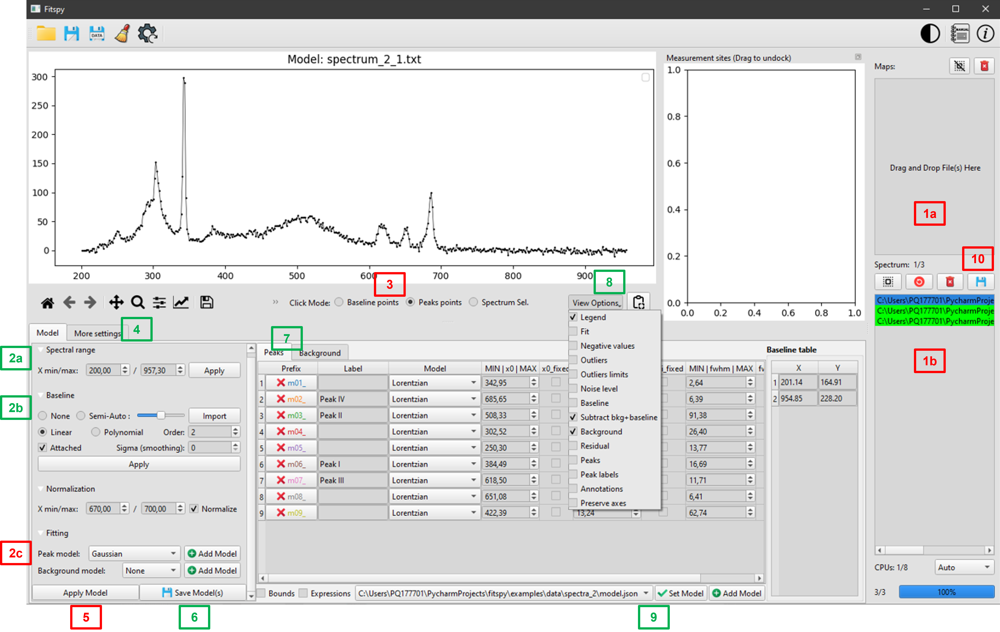
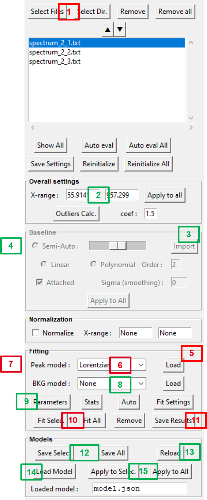
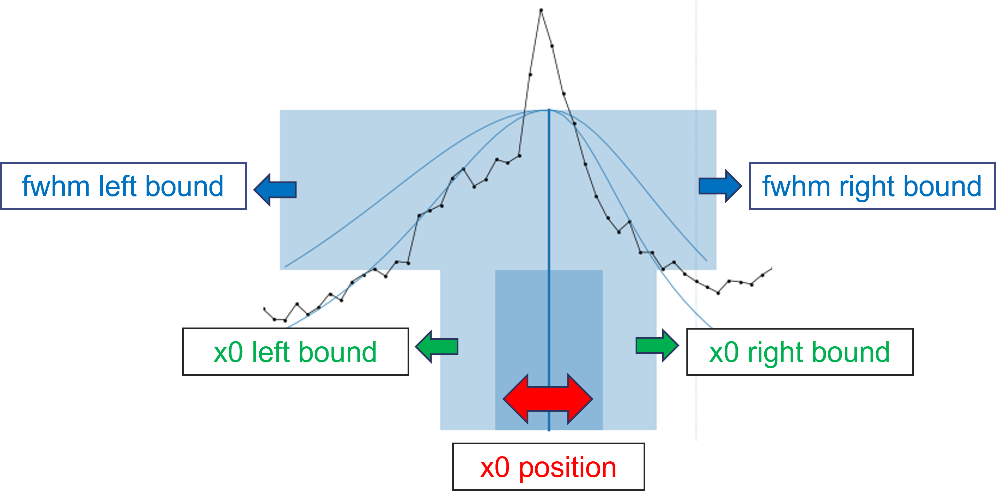

Workflow
========

All the spectra fitting operations can be realized both through the GUI or by python scripts.

However, although python scripts can be very practical when working with repetitive actions (like batches in the case of parametric studies for instance), from a practical point of view, it is easier:

- 1/ to use the GUI to define a `Fitspy` model **visually**, then

- 2/ to apply it to new data sets.

GUI Mode
--------

PySide GUI:
~~~~~~~~~~~

.. raw:: html

    

**To create a `Fitspy` model:**

- (`1 <gui.html?files_selection>`_) **Select file(s) using drag an drop mode**
- (`2a <gui.html?overall_settings>`_) *Define the* :code:`X-range`
- (`2b <gui.html?baseline>`_) *Select the baseline mode*
- (`3 <gui.html?baseline>`_) *if* :code:`Linear` *or* :code:`Polynomial` *mode, click on the* :code:`Baseline Points` and select them on the main figure* **(*)**
- (`2c <gui.html?fitting>`_) **Select a** :code:`Peak model`
- (`3 <fitting.html>`_) **After clicking on** :code:`Peaks points`, **Select them on the main figure (*)**
- (`3 <gui.html?fitting>`_) *Add a background* (:code:`BKG model`) *to be fitted*
- (`4 <fitting.html>`_) *Adjust extra-parameters*
- (`5 <fitting.html>`_) :code:`Fit` **the spectrum/spectra selected in the files selector widget**
- (`7 <gui.html?fitting>`_) *Use the peak and bkg tables to see the results and to set bounds and constraints for a new fitting*
- (`6 <gui.html?models>`_) :code:`Save` *the Model(s) in a `.json` file (to be replayed later)*

**(*)** *use left/right click on the figure to add/delete a baseline or a peak point*

Once saved, a `Fitspy` model enables to recover a previous state (as-it, if all the spectra defined in the model can be loaded again) as follows:

- (`9 <gui.html?fitting>`_) :code:`Add` *the `Fitspy` model (`.json` file)*
- (`5 <gui.html?fitting>`_) :code:`Fit` **the selected spectra**
- (`10 <fitting.html>`_) :code:`Save Results` (**fitted parameters** and **statistics**)

Or, after removing all spectra in the file selector widget (:code:`Remove All`), the `Fitspy` model can be apply to another data set as follows:

- (`1 <gui.html?files_selection>`_) **Select file(s) using drag an drop mode**
- (`9 <gui.html?models>`_) :code:`Add Model` *And select it from the Combobox*
- (`15 <gui.html?models>`_) :code:`Apply Model`
- (`10 <fitting.html>`_) **Save results** (**fitted parameters** and **statistics**)

Tkinter GUI:
~~~~~~~~~~~

.. raw:: html

    

**To create a `Fitspy` model:**

- (`1 <gui.html?files_selection>`_) **Select file(s) from** :code:`Select Files`  **or**  :code:`Select Dir`
- (`2 <gui.html?overall_settings>`_) *Define the* :code:`X-range`
- (`3 <gui.html?baseline>`_) *Click on the* :code:`Baseline` *panel to activate it (if not)*
- (`4 <gui.html?baseline>`_) *Select baseline points on the main figure* **(*)**
- (`5 <gui.html?fitting>`_) **Click on the** :code:`Fitting` **panel to activate it (if not)**
- (`6 <gui.html?fitting>`_) **Select a** :code:`Peak model`
- (`7 <gui.html?fitting>`_) **Select a peak point on the main figure (*)**
- (`8 <gui.html?fitting>`_) *Add a background* (:code:`BKG model`) *to be fitted*
- (`9 <gui.html?fitting>`_) *Use* :code:`Parameters` *to see the results and to set bounds and constraints for a new fitting*
- (`12 <gui.html?models>`_) :code:`Save Select` *or* :code:`Save All` *the `Models` in a `.json` file (to be replayed later)*

**(*)** *use left/right click on the figure to add/delete a baseline or a peak point*

Once saved, a `Fitspy` model enables to recover a previous state (as-it, if all the spectra defined in the model can be loaded again) as follows:

- (`13 <gui.html?fitting>`_) :code:`Reload` *the `Fitspy` model (`.json` file)*
- (`10 <gui.html?fitting>`_) :code:`Fit Selec.` **or** :code:`Fit All` **the spectra**
- (`11 <fitting.html>`_) :code:`Save Results` (**fitted parameters** and **statistics**)

Or, after removing all spectra in the file selector widget (:code:`Remove All`), the `Fitspy` model can be apply to another data set as follows:

- (`1 <gui.html?files_selection>`_) **Select file(s) from** :code:`Select Files`  **or**  :code:`Select Dir`
- (`14 <gui.html?models>`_) :code:`Load Model` *(associated to the first `spectra` if several)
- (`15 <gui.html?models>`_) :code:`Apply to Sel.` *or* :code:`Apply to All`
- (`11 <fitting.html>`_) :code:`Save Results` (**fitted parameters** and **statistics**)

Interactive bounds:
~~~~~~~~~~~~~~~~~~~

Since version 2025.4, bounds can be adjusted interactively using the mouse.

When a new peak is added, model parameters are estimated based on the local profile of the spectrum.

The user can then move the entire set of bounding boxes by clicking and dragging the dark blue area, which updates the values of both **x0** and **ampli**.

The **bounds** related to **x0** and **fwhm** can be modified by dragging the left/right edges of the lower and upper bounding boxes, respectively.

Note that for **symmetric** models, the left and right **fwhm bounds** are synchronized, contrarily to **asymmetric** models that allow independent control of the left and right fwhm values.

Scripting Mode
--------------

Although it is more recommended to use the GUI to define a `Fitspy` model **visually** , here is a partial example of how to do it by script::

    from fitspy.core.spectrum import Spectrum

    spectrum = Spectrum()

    # load a spectrum to create the model
    spectrum.load_profile(fname=r"C:\Users\...\H-000.txt", xmin=150, xmax=650)

    # baseline definition and subtract
    spectrum.baseline.points = [[160, 600], [52, 28]] # (x, y) baseline points coordinates
    spectrum.subtract_baseline()

    # peak models creation (based on 2 peaks)
    spectrum.add_peak_model('Lorentzian', x0=322)
    spectrum.add_peak_model('Gaussian', x0=402)

    # model saving
    spectrum.save(fname_json=r"C:\Users\...\model.json")

.. note::

    During the peak model creation, other parameters can be passed to `add_peak_model() <../api/fitspy.core.html#fitspy.core.spectrum.Spectrum.add_peak_model>`_ (see the API doc).
    Given the large number of parameters, only the main ones have been retained as arguments. Therefore, to have fine control over each parameter, you can use a dictionary as follows::

        peaks_params = {1: {'name': 'Lorentzian',
                            'x0': {'value': 322, 'min': 300, 'max': 330},
                            'fwhm': {'value': 30, 'min': 22, 'max': 45}},

                        2: {'name': 'Lorentzian',
                            'x0': {'value': 402, 'vary': False},
                            'ampli': {'expr': '0.5*m01_ampli'}},

                        3: {'name': 'LorentzianAsym',
                            'x0': {'value': 445},
                            'fwhm_l': {'value': 30, 'min': 20, 'max': 47},
                            'fwhm_r': {'value': 20, 'min': 10, 'max': 25}}}

        # create peaks with default values (name and x0 are the mandatory values)
        for params in peaks_params.values():
            spectrum.add_peak_model(params['name'], params['x0']['value'])

        # replace default values by the user's ones ('min', 'max', 'vary', 'expr')
        for peak_model, params in zip(spectrum.peak_models, peaks_params.values()):
            [peak_model.set_param_hint(key, **vals) for key, vals in params.items() if key != 'name']

A full example is available here: `ex_nogui_peak_models_parameters_setting.py <https://github.com/CEA-MetroCarac/fitspy/tree/main/examples/ex_nogui_peak_models_parameters_setting.py>`_

Once defined, a `Fitspy` model saved in a '.json' file can be applied to a more consequent data set as follows::

    from pathlib import Path
    from fitspy.core.spectra import Spectra
    from fitspy.core.spectrum import Spectrum

    fnames = Path(r"C:\Users\...").glob('*.txt') # list of the spectra pathnames to handle
    model = r"C:\Users\...\model.json" # model pathname to work with

    # Spectra object creation
    spectra = Spectra(fnames=fnames)

    # Fitspy model loading and application
    spectra.apply_model(model, ncpus=16)

    # Calculated fitting parameters saving
    spectra.save_results(dirname_results=r"C:\Users\...\results")
