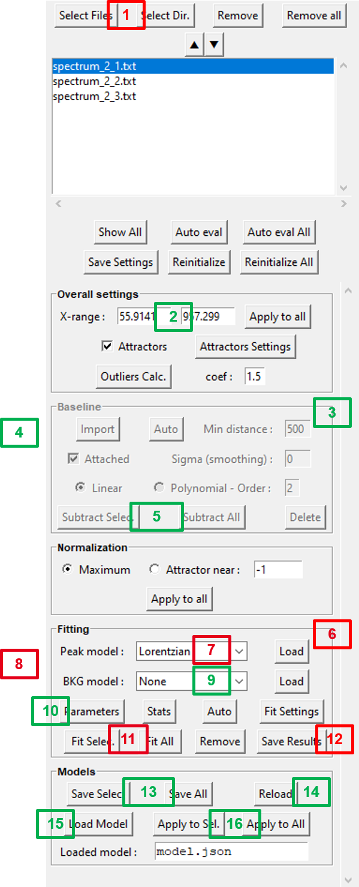

Workflow
========

All the spectra fitting operations can be realized both through the GUI or by python scripts.

However, although python scripts can be very practical when working with repetitive actions (like batches in the case of parametric studies for instance), from a practical point of view, it is easier:

- 1/ to use the GUI to define a `Fitspy` model **visually**, then

- 2/ to apply it to new data sets.

GUI Mode
--------

.. raw:: html

    

**To create a `Fitspy` model:**

- (`1 <gui.html?files_selection.html>`_) **Select file(s) from** :code:`Select Files`  **or**  :code:`Select Dir`
- (`2 <gui.html?overall_settings.html>`_) *Define the* :code:`X-range`
- (`3 <gui.html?baseline.html>`_) *Click on the* :code:`Baseline` *panel to activate it (if not)*
- (`4 <gui.html?baseline.html>`_) *Select baseline points on the main figure* **(*)**
- (`5 <gui.html?baseline.html>`_) :code:`Subtract Selec.` the baseline to the selected spectra *or* :code:`Subtract All` the baseline(s)
- (`6 <gui.html?fitting.html>`_) **Click on the** :code:`Fitting` **panel to activate it (if not)**
- (`7 <gui.html?fitting.html>`_) **Select a** :code:`Peak model`
- (`8 <gui.html?fitting>`_) *Select a peak point on the main figure* **(*)**
- (`9 <gui.html?fitting>`_) *Add a background* (:code:`BKG model`) *to be fitted*
- (`10 <gui.html?fitting>`_) *Use* :code:`Parameters` *to see the results and to set bounds and constraints for a new fitting*
- (`13 <gui.html?models>`_) :code:`Save Select` *or* :code:`Save All` *the `Models` in a `.json` file (to be replayed later)*

**(*)** *use left/right click on the figure to add/delete a baseline or a peak point*

Once saved, a `Fitspy` model enables to recover a previous state (as-it, if all the spectra defined in the model can be loaded again) as follows:

- (`14 <gui.html?fitting>`_) :code:`Reload` *the `Fitspy` model (`.json` file)*
- (`11 <gui.html?fitting>`_) :code:`Fit Selec.` **or** :code:`Fit All` **the spectra**
- (`12 <fitting.html>`_) :code:`Save Results` (**fitted parameters** and **statistics**)

Or, after removing all spectra in the file selector widget (:code:`Remove All`), the `Fitspy` model can be apply to another data set as follows:

- (`1 <gui.html?files_selection.html>`_) **Select file(s) from** :code:`Select Files`  **or**  :code:`Select Dir`
- (`15 <gui.html?models>`_) :code:`Load Model` *(associated to the first `spectra` if several)
- (`16 <gui.html?models>`_) :code:`Apply to Sel.` *or* :code:`Apply to All`
- (`12 <fitting.html>`_) :code:`Save Results` (**fitted parameters** and **statistics**)

Scripting Mode
--------------

Although it is more recommended to use the GUI to define a `Fitspy` model **visually** , here is a partial example of how to do it by script::

    from fitspy.spectrum import Spectrum

    spectrum = Spectrum()

    # load a spectrum to create the model
    spectrum.load_profile(fname=r"C:\Users\...\H-000.txt", xmin=150, xmax=650)

    # baseline definition and subtract
    spectrum.baseline.points = [[160, 600], [52, 28]] # (x, y) baseline points coordinates
    spectrum.subtract_baseline()

    # peak models creation (based on 2 peaks)
    spectrum.add_peak_model('Lorentzian', x0=322)
    spectrum.add_peak_model('Gaussian', x0=402)

    # model saving
    spectrum.save(fname_json=r"C:\Users\...\model.json")

Once defined, a `Fitspy` model saved in a '.json' file can be applied to a more consequent data set as follows::

    from pathlib import Path
    from fitspy.spectra import Spectra
    from fitspy.spectrum import Spectrum

    # list of the spectra pathnames to handle
    dirname = Path(r"C:\Users\...")
    fnames = dirname.glob('*.txt')

    # Spectra object creation
    spectra = Spectra()
    for fname in fnames:
        spectrum = Spectrum()
        spectrum.load_profile(fname)
        spectra.append(spectrum)

    # Fitspy model loading and application
    model = Spectra.load_model(fname_json=r"C:\Users\...\model.json")
    spectra.apply_model(model, ncpus=16)

    # save the calculated fitting parameters
    spectra.save_results(dirname_results=r"C:\Users\...\results")
