# Fitspy Documentation

## Introduction

The main class of Fitspy is [`Spectra`](../fitspy/spectra.py) (inherited
from `list`) that contains a list of  [`Spectrum`](../fitspy/spectra.py)
objects.

For each of these [`Spectrum`](../fitspy/spectra.py) objects,
an (x, y) profile is associated.

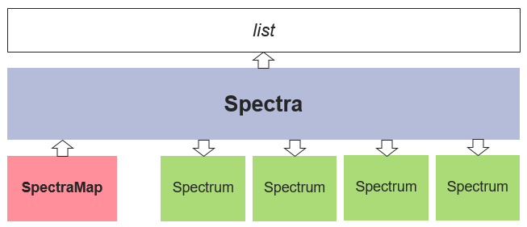

Given the users instructions, a `baseline`
can be defined, as well as a list of `peaks` models (Gaussian, Lorentzian
, ...) used to fit the spectra profiles.

In term of usage, it is recommanded to address spectra processing from the
top frames (`files selection`, `global actions`, ...) to the bottom ones
(..., `Peaks`, `Models`)

#### Notes

*Axis limits* : To ease the comparison between spectra, the axis limits of the
figure are
defined from the first displayed spectrum and are applied to all the
following ones.
To readapt the axis limits to the current spectrum click
on 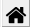 of the navigation toolbar
(auto-rescaling).

*Mouse management*: click buttons with the mouse is used with the
navigation toolbar for zooming and translating as well as for defining
baseline points or peaks points.
The activation/deactivation of the 2 last modes requires the baseline
or the peak frame to be clicked beforehand.

## Files selection

The files selection is realized thanks to the following widget:

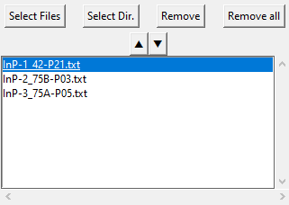

Two types of data can be interpreted.

* The first one consists in input data files that contains 2 columns
  related to respectively the support (x) and the spectrum intensity (y).
  The separators between the columns can be the tabulation `\t`, the coma
  `,`, the semicolon `;` or the space ` `. Note that the first row is skipped
  and the (x, y) rows can be unordered.

* The second one is related to **2D-map** input data. the first line of the
  file is related to the support (x) of the spectra and starts with 2
  tabulations `\t`. the next rows are related to the spectra intensity at
  the 'pixel' coordinates (X), (Y) defined in the 2 firsts columns.
  Note that the number of intensity values has to be consistent with the
  support (x)
  defined in the first row. X-Y spectra can be stored as a partial and
  an unordered 2D grid.

## Global actions

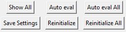

`Show All` allows to have a global vision of all the spectra. (The more the
spectra they are, the more the time for display is long). When clicking
with
the mouse on the canvas, the nearest spectra are highlighted (in the limit
of 10 spectra max)

`Auto eval / Auto evall All` realizes automatic evaluation of baseline and
peaks positions and operates fitting to the selected spectrum/spectra or
(resp.) to all the spectra.

`Save settings` allows to save the users settings in .fitspy.json
loacated in the %HOMEUSER/ (see this file to see what kind of settings are
saved)

`Reinitialize / Reinitialize All` refreshes the spectra

## Overall settings

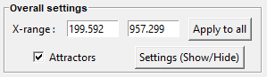

`X-range`  allows to display and modifiy the (x) support range associated
to the current spectrum.

`Apply to All`  applies the (x) support range `X-range` to all the spectra.

`Attractors` are related to local maxima intensities. If activated)
attractors are used for baseline points and peaks position locations.
The attractors points are calculated with scipy.signal.find_peaks()
from the parameters defined in `Settings`.
See [scipy.signal.find_peaks](https://docs.scipy.org/doc/scipy/reference/generated/scipy.signal.find_peaks.html)
for more details.

## Baseline

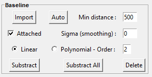

The present widget is (de)activated when clicking on it

`Import` allows the user to import its own baseline profile. The
imported file should contain 2 columns associated to the (x,y) baseline
points coordinates. The separators between the columns can be the tabulation
`\t`, the coma `,`, the semicolon `;` or the space ` `. Note that the first
row is skipped and the (x, y) rows can be unordered.

`Auto` can be used for an automatic determination of the baseline
points considering a the `Min distance` (minimum distance) between two
consecutive points (in pixel).

`Attached` makes the baseline attached to the raw spectrum profile or to
a smoothed one based on a gaussian filtering using `Sigma` as standard
deviation (in pixel).

Baseline profiles are defined either from `Linear` piecewise or from
`Polynomial` approximation considering the given `Order`.
Note that a '*n*'-order polynomial approximation requires at least '*n+1*'
points

## Normalization

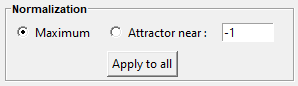

Spectra normalization is an **option** relying on one of the two strategies:

`Maximum` : each spectrum is renormalized at 100 according to its maximum 
intensity.

`Attractor` : each spectrum is renormalized at 100 according to the 
intensity of the nearest attractor located at the x-position given by the user.

To be effective, the user should press on `Apply to all`

## Peaks

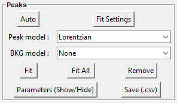

The present widget is (de)activated when clicking on it.

`Auto` can be used for an automatic determination of the peaks, considering 
the selected `Peak model`. 

For a user manual peaks positioning, the `Peak model` (to choose 
between `Gaussian`, `Lorentzian`, `Asymetric Gaussian`, `Asymetric 
Lorentzian` and `Pseudovoigt`) is applied when left-clicking in the spectrum 
figure. A right click allows to remove the nearest peak.

The available peak models are:

* `Gaussian` : $ampli * e^{-(x-x0)^2/(2*\sigma^2)}$
* `Lorentzian` : $ampli * \frac{fwhm^2}{4 * ((x - x0)^2 + fwhm^2 / 4)}$
* `Asymetric Gaussian` : $(x < x0) * Gaussian(fwhm\_l) +  (x >= x0) * 
  Gaussian(fwhm\_r)$
* `Asymetric Lorentzian` : $(x < x0) * Lorentzian(fwhm\_l) +  (x >= x0) * Lorentzian(fwhm\_r)$
* `Pseudovoigt` : $alpha * Gaussian + (1 - alpha) * Lorentzian$

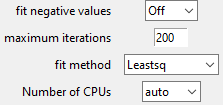

`Fit` and `Fit All` realize fitting in the conditions defined in `Fit 
Settings`. Note that `maxmimum iterations` can be used to limit the number 
of iterations and save CPU time processing. 1 iteration corresponds to one 
gradient descent related to all the fit parameters. Spectrum fit success 
related to convergence before reaching the `maxmimum iterations`  or 
failure are displayed respectively in green or orange in the file selector widget.

Note that doing several successive fit on a spectrum may change slightly the
fit parameters.

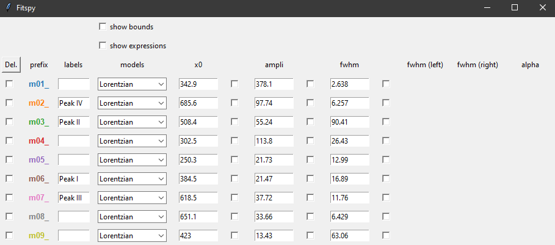

`Parameters` allows to visualize parameters values and statistics related to 
the fitting processing. The parameters widget can be used to interact with 
each of the spectra (deleting, labelling, models redefinition). Each 
parameter can be fixed during the fitting thanks to the selection boxes 
(all parameters are considered as free by default). 
Bounds and fit constraints can be adressed when activating the selectors in 
the top of the widget.

Bounding consists in giving left and right parameters bounds.

Constraints relies on expressions that can be parameters dependant, 
using the prefix defined in the 2nd column. Example below shows how to 
constrain the first fitted peak to be twice the second one in term of 
amplitude.

`Save (.csv)` consists in saving parameters fit results and statistics in a 
folder predefined by the user, in a .csv and a .txt file (resp.) using the 
same spectrum file basename.

## Models

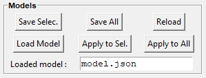

The **Models** frame is used to save and replay a full spectra processing as 
is. 

`Save Selec.` or `Save All` allow to save the spectra processing 
associated to the cursor selection in the file selection widget or to all the 
spectra respectively.

`Reload` replays exactely the spectra processing related to the imported .
json. This implies all the file pathnames are reachables when reloading.

`Load Model` consists in reloading spectrum models (baseline, peaks, ...) 
related to the first one saved in the .json.

`Apply to Sel.` or `Apply to All` allow to apply the prvious spectrum 
models to the cursor selection in the file selection widget, or to all the 
spectra respectively. 

## Figure

The Figure area displays the loaded spectra and allows to make baseline and 
peaks models manipulation with the mouse.

The standard navigation toolbar  from **Matplotlib** allows to pan, zoom 
and save the current figure. the function related to the 
  icon has been reconfigured to 
allow spectra rescaling.

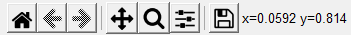

Figure settings allows to personalize plots displaying and figure `title`, 
`x-label`, `y-label`.

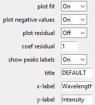

All the figures can be saved in .png format. (beware of 2D-maps which can 
engender a large amount of figures)

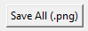

To ease copy/paste,  `CTRL + C` allows to put the current figure in the
clipboard (only on Windows).

